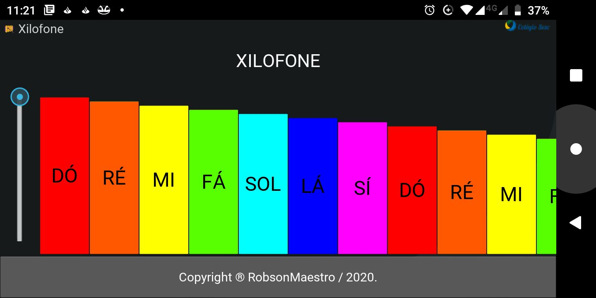
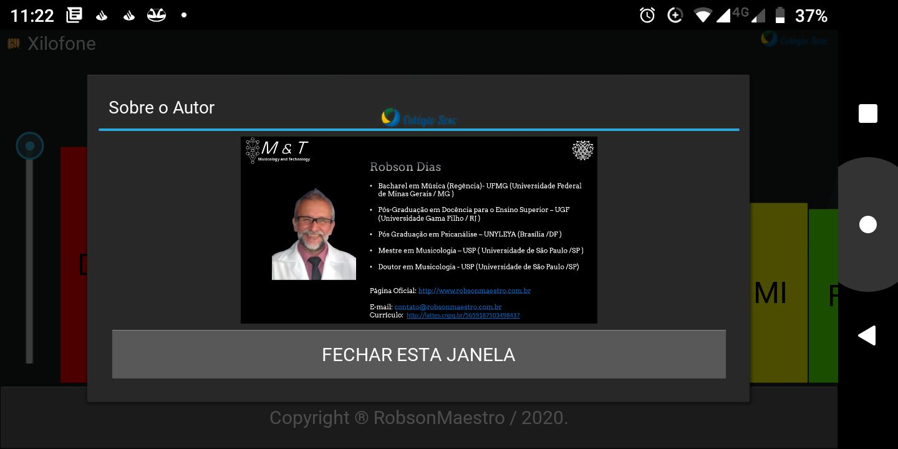

## Aplicação Mobile escrita originalmente em Python/Kivy

Este xilofone foi desenvolvido com intuito de auxiliar as crianças do Colégio Sesc Araxá neste momento de pandemia. É uma aplicação para android e esteve disponível no ano de 2020 na PlayStore.

## Telas do Aplicativo:

## Instalação
Caso deseje instalar o aplicativo os executáveis se encontram na pasta bin

## Compilação
Utilizar o buildozer

## Detalhes sobre o Código
Por ser uma aplicação muito rudimentar não escalável, optamos por colocar todo o código nos arquivos main.py e audio.kv, utilizando comentarios para dividir as seções.

## Observação importante.
A instalação do aplicativo pela PlayStore teve alguns problemas. A maioria dos usuários não conseguiam baixar a aplicação para seus dispositivos ("Dispositivo imcompatível"). Optamos por refazer o projeto utilizando Flutter.
